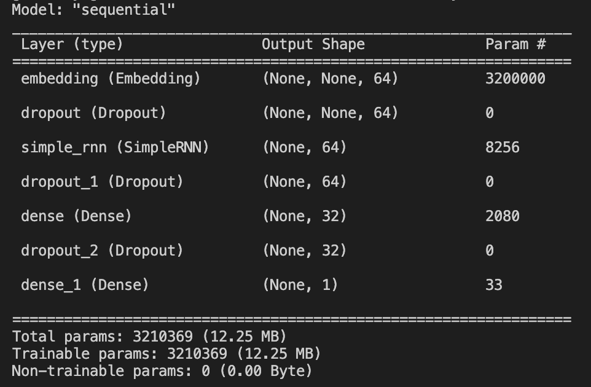
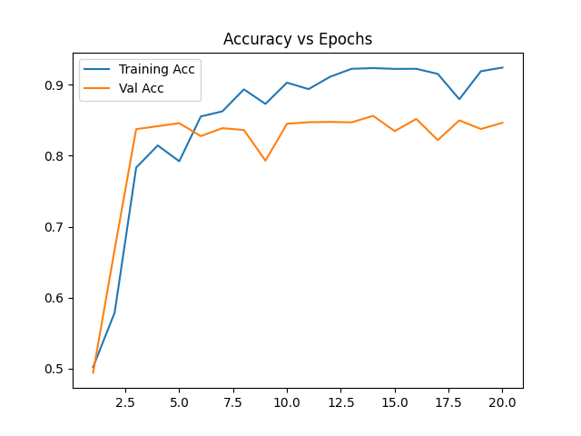
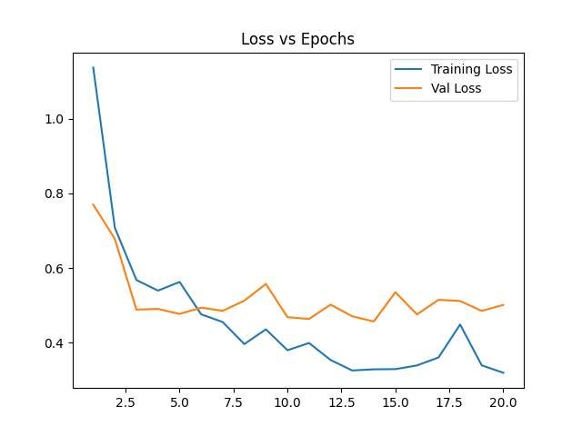

# IMDb Review Sentiment Analysis

## Project Overview
This project analyzes IMDb movie reviews to predict the sentiment (positive or negative) of each review. The goal is to build a machine learning model that can classify a review based on its text content, making use of various natural language processing techniques and deep learning models. It is a work in progress as I am still trying to achieve a higher accuracy on the model.

## Dataset
The dataset used is the imdb dataset with 50000 words. It is split into Test and Train datasets of 25000 each, and the Train dataset is further split with 20% of it being used as a validation dataset.

## Model
The model being used is a simple Neural Network with an RNN layer.

### Findings
Initially, the only layers being used were the Embedding layer, Simple RNN layer a Dense layer with a a sigmoid activation function. The model is being compiled with the **rmsprop** optimizer and the binary cross entropy loss function. The word count in the dataset was 30,000 words.  
The accuracy on this model was around ~92% on the training set and ~78% on the validation set.  

To increase the accuracy and reduce the loss on the trainin and validation set, I increased the dataset to 50000 words, and tried to increase the size of the network. I added another Dense layer with the sigmoid activation function, and added dropout layers with the percentage of 30% to try and reduce overfitting. I also added an L2 regularizer to the layers. After several uterations, this is what the model looked like.
 

## Project Files
1. **`data_processing.py`**: Handles the data loading, cleaning, and preprocessing of the IMDb review dataset.
2. **`model_architecture.py`**: Contains the neural network architecture used for training and evaluation.
3. **`main.py`**: Loads the data, compiles the model and saves it.
4. **`homepage.py`**: Provides the front-end functionality or basic user interface to input a review and get the sentiment classification.

## Accuracy 
In the latest iteration, the accuracy on the validation dataset is 84% and the accuracy on the training set is ~95%.

## Conclusion
The model is still being worked on with the goal of getting both the training and validation accuracy to ~95%.